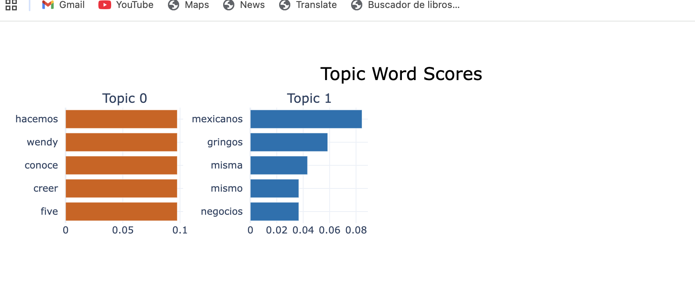

# Gentrification Analytics: A Mixed-Methods Approach (NLP + GIS)

**Social Data Science Portfolio: Quantifying Urban Displacement in Mexico City**

**Project Status:** Complete | **Tech Stack:** Python, NLP (Transformers), Geospatial Intelligence (GIS).

This portfolio is an interactive proyect.
---


## Executive Summary


Gentrification is a hotly debated topic in Mexico City (CDMX), often driven by anecdotal evidence. This project moves beyond "social noise" to provide **structured, data-driven evidence**. By applying a **Mixed-Methods approach**, this research **triangulates** unstructured social data (Reddit discourse) with structured economic data (Airbnb listings) to answer three core business questions:

1.  **The "What" (Sentiment):** Quantifying public perception using NLP.
2.  **The "Why" (Drivers):** Identifying root causes via Topic Modeling.
3.  **The "Where" (Location):** Pinpointing the physical phenomenon using Geospatial Mapping.

## Technical Architecture

* **Language:** Python 3.9+
* **Data Collection:** Reddit API (PRAW), Inside Airbnb (Open Data).
* **NLP Pipeline:** `Pysentimiento` (Transformer-based Sentiment Analysis), `BERTopic`.
* **Geospatial Stack:** `Geopandas` (Spatial Analysis), `Folium` (Interactive Visualization).
* **Data Manipulation:** Pandas, NumPy.

## Phase 1: Sentiment Analysis ("The What")

* **Methodology:** Leveraged the Reddit API to scrape community discussions and applied `Pysentimiento` to analyze the emotional tone of the discourse.
* **Key Finding:** Public sentiment was unequivocally **Negative**, with an average polarity score of **-0.57**. This established a baseline of high social friction.

---

## Phase 2: Topic Modeling ("The Why")

To understand the *drivers* behind the negative sentiment (-0.57), I deployed a **BERTopic model** (Transformer-based) with a **custom stop-word list** to filter out conversational noise and isolate semantic meaning.

### Key Insight: Socioeconomic Friction

The model successfully clustered the data, identifying **Topic 1** as the primary source of tension:

* **Topic 1 (Dominant):** Socioeconomic & Cultural Confrontation.
    * *Keywords:* `mexicanos` (Mexicans), `gringos` (Foreigners), `negocios` (Businesses), `economía` (Economy).
* **Inference:** The negative polarity is not random; it is driven by a perceived **economic displacement**, connecting foreign influx directly to local business dynamics.



## Phase 3: Geospatial Intelligence ("The Where")

**Business Question:** Is this friction just "online noise," or does it correlate with physical reality?

* **Methodology:** Analyzed **26,401** listings from **Inside Airbnb**.
* **Analysis:** Used `Geopandas` to process spatial data and generated `Folium` interactive maps.
* **Visualization:** Created **Density Heatmaps** and **Price Clusters**.

### 💡 Key Insight: Data Validation (Ground Truth)
The Heatmap validates the social discourse. The clusters with the highest Airbnb density and pricing **perfectly overlap** with the neighborhoods identified in the NLP analysis (e.g., Roma, Condesa). This confirms that the online sentiment is anchored in tangible market realities.

**Interactive Map Demo:**
*(Visualizing density heatmaps vs. price distribution)*


## Conclusion: The Power of Data Triangulation

This project demonstrates how Social Data Science can transform anecdotal debates into structured business intelligence:

1.  **NLP (Reddit):** Quantified the *perception* of socioeconomic conflict.
2.  **GIS (Airbnb):** Verified the *location* and economic density of the phenomenon.

By combining these datasets, we obtain a holistic view of how market shifts (Airbnb) impact social sentiment in real-time.

  

## How to Reproduce this Analysis

This project is 100% reproducible. Follow these steps to verify findings:

1.  **Clone the Repository:**
    ```bash
    git clone [https://github.com/cecirascon582-star/Reddit-Sentiment-Analysis-Gentrification.git](https://github.com/cecirascon582-star/Reddit-Sentiment-Analysis-Gentrification.git)
    ```

2.  **Environment Setup:**
    Create a `.env` file in the root directory with your Reddit API credentials (`REDi`, `REDDit`).

3.  **Data Acquisition:**
    Download the latest `listings.csv` for Mexico City from [Inside Airbnb](http://insideairbnb.com/get-the-data/) and place it in the root folder.

4.  **Install Dependencies:**
    ```bash
    pip3 install -r requirements.txt
    ```

5.  **Run the Pipeline:**
    ```bash
    python3 "Prueba3 adv.py"       # Step 1: Sentiment Analysis
    python3 "Parte 2/Topic.py"     # Step 2: Topic Modeling (BERTopic)
    python3 "Geo.py"               # Step 3: Geospatial Mapping
    ```


### 📝 Limitations & Ethical Considerations

* **Sample Bias:** Reddit users do not represent the entire demographic of Mexico City.
* **Temporal Scope:** This analysis represents a snapshot in time and does not account for seasonal market fluctuations.
